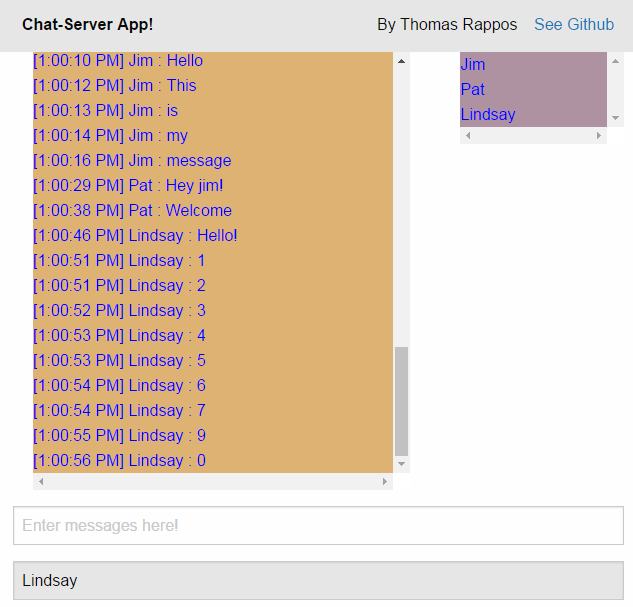
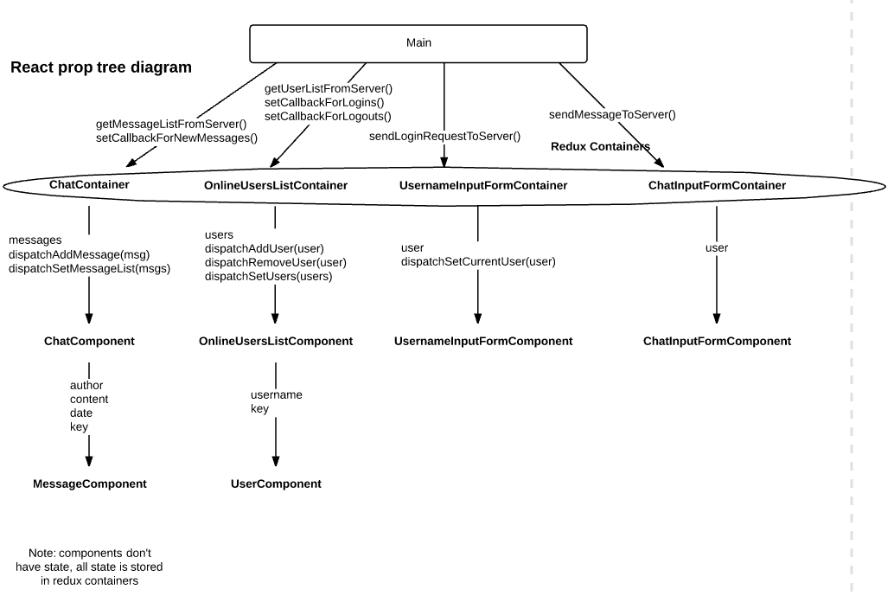
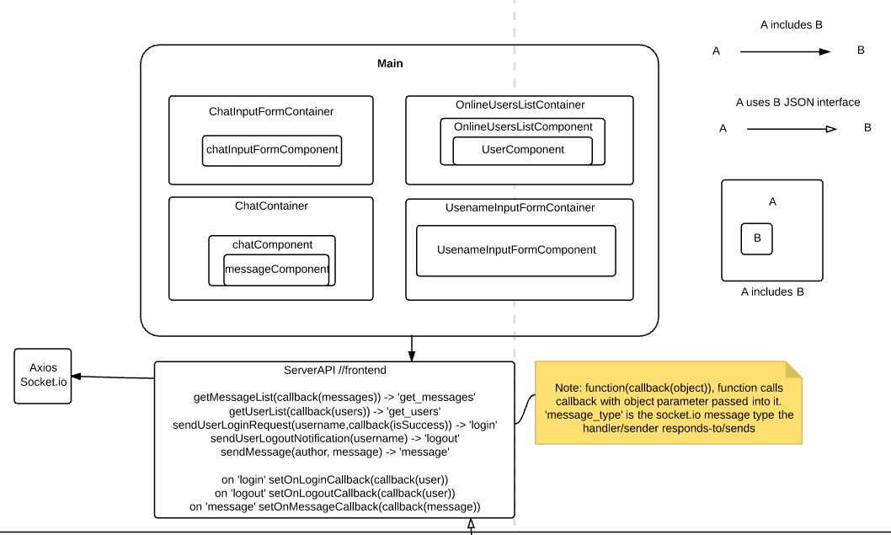
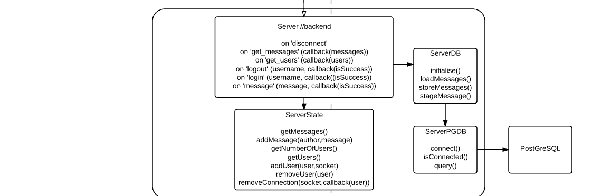
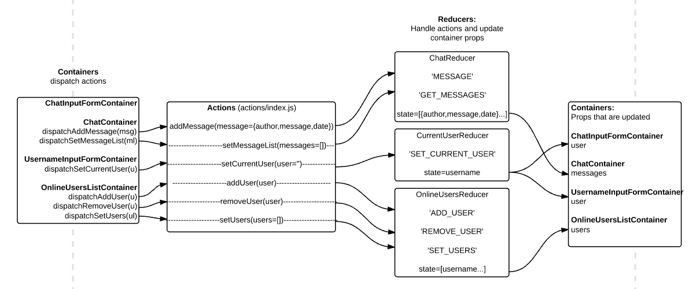

# Chat Server

[](https://travis-ci.org/t-rappos/auction-system)

This application was created to test a proposed technology stack for web applications.
It was also successfully deployed on [Heroku](https://chat-server-t-rappos.herokuapp.com/#/?_k=32gzvg).



## Features
- User can set name.
- User can see list of online users.
- User can post messages.
- User can see an up-to-date list of messages.
- Application runs in real-time without needing webpage refreshes.

## Technology Stack

### Front-end
- React
- Redux
- Socket.io-client
- Webpack

### Back-end
- Node.js
- Express
- PostgreSQL
- Socket.io

### ES6
This project uses ES6 as enabled by the following modules:

- Client
  - babel-core | babel transpiles es6 to js for browser compatability
  - babel-loader | enables babel for webpack

- Server
  - babel-cli | command line interface for babel
  - nodemon | watches server.js for changes and restarts server (with babel re-build)

### Persistance
- Heroku idles free-tier webapps after 30 minutes if they aren't receiving traffic, this means that the server-state will be reset often and the messages stored on the server will be lost. To avoid this, a PostgreSQL database was used.

- All messages are loaded from DB when server is started
- Periodically all recently added messages are sent to the database to be stored

### Continuous Integration & Deployment
  - Has been setup with travis-ci
  - Runs test suite every push to github
  - Heroku pulls code whenever a chat-server branch git-push successfully passes travic-CI checks

### Testing
- karma
  - spawns webserver and runs tests in browser
- mocha
  - javascript test framework
- jquery
  - for inspecting the DOM
- expect
  - better syntax and functionality for making test assertions.

Testing is two-phased, server code is tested first and then client code.


#### Client

The package.json script ```"test-app": "./node_modules/.bin/karma start"``` will run karma for the client tests defined in karma.conf.js.

Tests were created for all of the React components, things that were tested in general include:
- Component renders in DOM with minimal amount of input
- Component throws error if required property is not passed (crashes are better than silent errors as we can see issues imediately)
- Component renders as expected with input specified

Noteable changes to codebase to enable testing:
- Calls to ServerApi within the components were abstracted out by setting new component callback properties to the existing serverApi calls within the main file. This is good as now only main.jsx needs reference to the serverApi.jsx file. This was done because of difficulties including serverApi.jsx as it uses socket.io which was causing test compilation issues.

#### Server
The package.json script ```"test-server": "mocha --reporter spec"``` will run mocha for the server tests in the /test folder.

lib/server.js tests
  - had to enable postgresql in travis-ci
  - testing socket io functionality (public interface for server.js)

TODO:
  - Explore how to test ServerAPI and redux containers

### Linting

Linting was used to ensure that the ES6 code used conforms to best standards for google, react and node. The following modules were used to enable this functionality:

- client
  - eslint | enable eslint functionality
  - eslint-import-resolver-webpack | enable import checks for webpack
  - eslint-loader | enable eslint for webpack, runs tests on webpack -w
  - eslint-plugin-react | enable react checks

- server
  - eslint
  - eslint-plugin-node | enable node checks
  - eslint-plugin-mocha | enable mocha checks
  - eslint-plugin-import
  - mocha-eslint | runs checks on npm test, see test/eslint.js for launch code


NPM test will run both server and client Linting checks and therefor will run during travis-CI deployment. If an error occurs the build will not pass.
a root .eslintrc.js file was created to config linting for client code TODO: move this into /app. Other .eslintrc.js files were created in /lib, /test and /app/test files to configure server, server-test and client-test file linting respectively.

### Code Coverage

#### Client

TODO: enable client code coverage

#### Server

- istanbul
- nyc
- mocha

Reports coverage during npm test, using the following package.json script ```"es6-coverage": "nyc --require babel-core/register mocha"```

### Styling
Foundation was used to style the apps CSS, in particular:
- Row and Column system was used to ensure that the app behaved correctly on pc and mobile platforms.
- The top-bar class was used as it provides a simple top bar for the webapp

### Package.json

```
"dependencies": {
  "babel-plugin-transform-class-properties": "^6.19.0",
  "babel-plugin-transform-runtime": "^6.15.0",
  "babel-polyfill": "^6.20.0",
  "babel-register": "^6.18.0",
  "body-parser": "^1.15.2",
  "dateformat": "^2.0.0",
  "express": "^4.14.0",
  "jquery": "^3.1.1",
  "pg": "^6.1.2",
  "react": "^15.4.2",
  "react-dom": "^15.4.2",
  "react-redux": "^5.0.2",
  "react-router": "^2.0.0",
  "redux": "^3.6.0",
  "socket.io": "^1.7.2"
},
"devDependencies": {
  "babel-cli": "^6.22.2",
  "babel-core": "^6.21.0",
  "babel-loader": "^6.2.10",
  "babel-preset-es2015": "^6.22.0",
  "babel-preset-react": "^6.5.0",
  "babel-preset-stage-0": "^6.16.0",
  "babel-preset-stage-2": "^6.22.0",
  "css-loader": "^0.26.1",
  "eslint": "^3.14.0",
  "eslint-config-google": "^0.7.1",
  "eslint-import-resolver-webpack": "^0.8.1",
  "eslint-loader": "^1.6.1",
  "eslint-plugin-import": "^2.2.0",
  "eslint-plugin-mocha": "^4.8.0",
  "eslint-plugin-node": "^3.0.5",
  "eslint-plugin-react": "^6.9.0",
  "expect": "^1.20.2",
  "foundation-sites": "^6.3.0",
  "istanbul": "^0.4.5",
  "karma": "^1.4.0",
  "karma-chrome-launcher": "^2.0.0",
  "karma-firefox-launcher": "^1.0.0",
  "karma-mocha": "^1.3.0",
  "karma-mocha-reporter": "^2.2.1",
  "karma-sourcemap-loader": "^0.3.7",
  "karma-webpack": "^2.0.1",
  "mocha": "^3.2.0",
  "mocha-eslint": "^3.0.1",
  "nodemon": "^1.11.0",
  "nyc": "^10.1.2",
  "react-addons-test-utils": "^15.4.2",
  "script-loader": "^0.7.0",
  "socket.io-client": "^1.7.2",
  "style-loader": "^0.13.1",
  "webpack": "^1.14.0"
}
```

## Design

### Front-end React Component Tree

This image displays the react components and the props being sent to children components.

### System Design



### Front-end Redux diagram


### Workflow
- webpack -w | Compiles files into webpack bundle for server, picks up compilation and linting errors, run this command to automatically compile changes to code when developing locally.
- NPM test | Runs the test suite and shows results.
- node server.js | Runs the server locally. Go to localhost:3000 to view webpage
- git add . | Adds changed files.
- git commit -m "commit message" | Selects for submitting changes remotely to github
- git push | Pushes commit to current remote branch, travis-CI then runs NPM test, and if the push was in chat-server branch and was successful then heroku will deploy to production.
