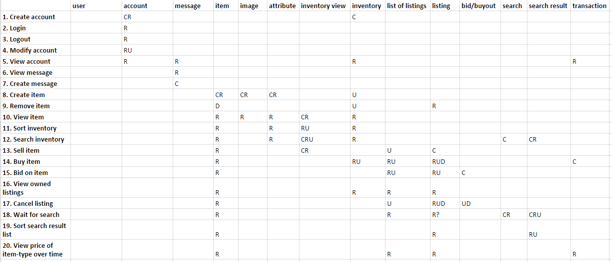
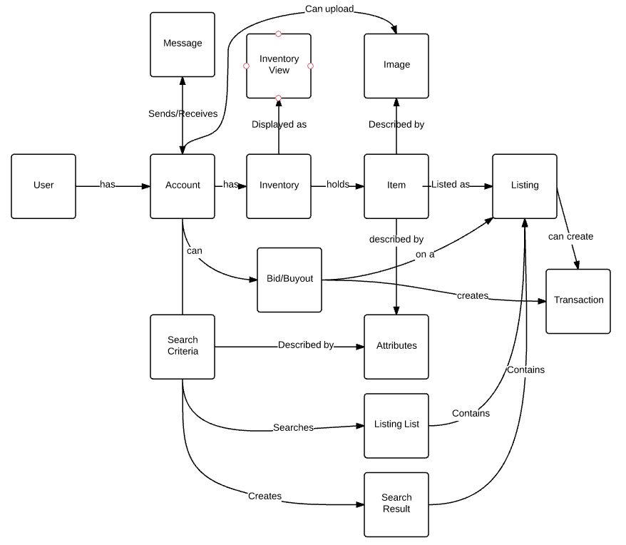

# Software Requirements Specifications

## 3.1 Introduction

### 3.1.1 Purpose

This document is intended to describe the user requirements for an auction listing system and will outline the users desired functionality.

### 3.1.2 Scope

This is a personal hobby project designed to provide experience working with multiple integrated systems. The goal of this project is to deliver a software solution that meets all of the user requirements product using an effective, scalable and collaborative development workflow. The software developed and technologies/workflows used are planned to be adapted for use in later projects.

## 3.2 Description

### 3.2.1 Perspective

This product will consist of a user-facing GUI with data processed and stored online.

### 3.2.2 Functions

The following is a list estimated user functionality, users can:

- Accounts
  - Create an account
  - Edit their account
  - Message other accounts
  - See received messages (loaded on login, and as they are sent)
  - Have associated currency amount for use
  - Login
  - Logout

- Items
  - Create items
  - View stored items
  - Sort stored items
  - See what items look like
  - Can be of a type/category/tag

- Listings
  - Sell and buy items
  - Auction and bid on items
  - Sold items trigger a 'item sold' message to be sent to the seller
  - Cancel listing

- Searching
  - Search for items to buy
  - Sort list of searched for items

### 3.2.3 Deferred Functions

The following is a list of functionality deferred for version 2.0 of the system

 - Items
  - Upload item image

 - Listings
  - Sell item (search for similar items to check recommended price)

 - Searching
  - Wait for item to appear that matches search criteria
  - View price of item type over time
  - TODO: ?idea? search criteria price over time?

### 3.2.4 Operating Environment

- Users will be able to use this software from a website GUI. It should work identically on ?Internet Explorer?, Firefox and Chrome on PC's and mobiles.
- Multiple users can use the software at any time

### 3.2.5 Domain Entities
- User
- Account
- Message
- Item
- Image
- Item Attribute
- Inventory
- Inventory View
- Listing
- Listing list
- Bid/Buyout
- Search criteria
- Search result
- Transaction

### 3.2.6 Actors

The following are the types of users that may use this software.

- Admin / Developer
  - Will require debug or extra observational functionality.
  - R1\. View history of all sales
  - R2\. Sort history of all sales by criteria

- Frequent user
  - Knows how to use the system, wants quick and effective functionality.

- Casual user
  - Needs extra information to describe the system for usage

TODO: Expand these actors into extra requirements

### 3.2.7 List of tasks

These are the tasks that are required to be supported by the software solution.

1. Create account
2. Login
3. Logout
4. Modify account
5. View account
6. View message
7. Create message
8. Create item
9. Remove item
10. View item
11. Sort inventory
12. Search inventory
13. Sell item
14. Buy item
15. Bid on item
16. View owned listings
17. Cancel listing
18. Wait for search
19. Sort search result list
20. View price of item-type over time

### 3.2.8 CRUD Check

#### CRUD Table

[Link to CRUD spreadsheet ](https://docs.google.com/spreadsheets/d/1MRDU_9CzYix6REQ6JA-69m1cYBdSQDAedr_KkLhzpeI/edit?usp=sharing)

#### Notes from CRUD analysis:
  - Accounts can't be deleted
  - Images can't be deleted
  - Messages cant be modified after creation
  - Item Attributes can't be deleted or updated
  - Inventory views can't deleted (But will be temporary objects, e.g. aren't stored)
  - Inventories aren't deleted
  - Nothing reads any bids/buyouts
  - Search criteria can't be deleted (...they are temporary)
  - Search results can't be deleted ("")
  - Transactions can't be deleted

#### Recommended action:
  - Create task to delete or disable account
  - Create task to delete images
  - Create task to delete item attributes
  - Update Bidding and Buyout tasks to read bid/buyouts

TODO: ^^

### 3.3 Tasks & Support
The following are descriptions of the supported user tasks. They don't explicitly outline an intended technical solution but provide a rough suggestion for the reader, as the aim is to outline the problem domain of the system (rather than the solution domain). Inspired from the whitepaper
[Task Descriptions as
Functional Requirements](http://www.itu.dk/~slauesen/Papers/IEEEtasks.pdf).

#### 3.3.1 Create Account
  - **Purpose:** Register the user with the system
  - **Trigger/Precondition:** User wants to use the system
  - **Frequency:** Once per user
  - **Critical:** N? amount per day
  - **Subtasks | Solution**
    1. collect user name | dialog box w/ name taken checker
    2. collect password | dialog box w/ password checker
    3. collect email | dialog box w/ email checker
    4. record account | register button
    5. notify user of successful registration | display success message
  - **Variants:**
    - 1a. username is taken | show error message
    - 2a. password isn't valid | ""
    - 3a. email taken | ""
    - 4a. user returns to previous page or exits | clear entered details

#### 3.3.2 Login
- **Purpose:** Authenticate the user and provide access to system (user session created)
- **Trigger/Precondition:** User-account is registered
- **Frequency:** Once per session per user (once per day)
- **Critical:** 5? times a day per user
- **Subtasks | Solution**
  1. Take username | dialog box w/ name taken checker
  2. Take password | dialog box w/ password checker
  3. Display homepage | Display a landing page with user account details displayed
- **Variants:**
  - 1a. Username is incorrect | display error "username/password incorrect"
  - 2a. Password is incorrect | display error "username/password incorrect"

#### 3.3.3 Logout
- **Purpose:** Cancel the users session with the system
- **Trigger/Precondition:** The user is logged in, User is inactive, System is restarted
- **Frequency:** Once per session per user (Once per day)
- **Critical:** 5? times a day per user
- **Subtasks | Solution**
  1. User signs out | User clicks a log-out button
  2. Display system login page | <--
- **Variants:**
  - 1a. User isn't logged in | do nothing

#### 3.3.4 Modify account
- **Purpose:** Change details or descriptions pertaining to the users account
- **Trigger/Precondition:** User is logged in. User clicks 'edit account'
- **Frequency:** Less than 10 times per user.
- **Critical:** Greater than 10 times per user.
- **Subtasks | Solution**
  1. User selects edit profile | Clicks Menu->Account->Edit Account
  2. collect profile attribute to edit | Selects text box
  3. collect changes to the selected attribute | Edits text where appropriate
  4. confirm updating profile | Clicks "confirm changes"
  5. Displays profile page
- **Variants:**
  - 3a. User makes no changes | no changes are made to the account
  - 3b. User makes changes but returns to previous page instead of confirming | no changes are made to the account

#### 3.3.5 View account
- **Purpose:** Display the details or descriptions pertaining to the users account
- **Trigger/Precondition:** User is logged in. User logs in or clicks 'view account'
- **Frequency:** 1-10 times per session per user
- **Critical:** 10+ times per session per user
- **Subtasks | Solution**
  1. User details are displayed | all of the users account attributes are displayed

- TODO: This may be too simple of a task -- and may be a subtask instead

#### 3.3.6 View message
- **Purpose:** The user can view a message that has been sent
- **Trigger/Precondition:** User is logged in, user gets message notification
- **Frequency:** twice per session per user
- **Critical:** 10 times per session
- **Subtasks | Solution**
  1. displays message notification
  2. user views messages | user navigates to message log
  3. collect message to view | clicks on message to view
  4. displays content of message - Message is recorded as read | message is displayed
- **Variants:**
  - 1a. clicks on message notification | opens message log page
  - 1b. clicks on messages from menu | opens message log page
- TODO: Change this to reply to message?

#### 3.3.7 Create message
- **Purpose:** Send a message to another user
- **Trigger/Precondition:** User is logged in, recipient account exists
- **Frequency:** less than once per session per user
- **Critical:** 10 or more times per session per user
- **Subtasks | Solution**
  1. user selects compose message | user navigates menu -> messages -> compose message
  2. collect recipient account name | user enters recipients account name
  3. collect message content | user enters message
  4. confirm sending and send to recipient | user clicks on send message
  5. display confirmation | message is displayed showing "message sent"
- **Variants:**
  - 2a. no account exists | display 'no such account exists' after username is entered, grey-out send message button
  - 3a. no message content is entered | grey out send-message button
  - 3b. too much message content is entered | grey out send-message button and display error message "too much text has been entered (500 char limit)"

#### 3.3.8 Create item
- **Purpose:** Populate the system with an item that can be used for selling.
- **Trigger/Precondition:** The user is logged in, Users inventory isn't full, (User selects "compose item")
- **Frequency:** 1-10x per session per user
- **Critical:** >10x per session per user
- **Subtasks | Solution**
  1. display inventory | inventory page is shown
  2. user selects compose item | use clicks on compose item button
  3. collect item name | enters details into text box
  4. collect item attributes | enters details into text boxs
  8. collect item image | a upload dialog opens, allowing the user to select an image to upload
  9. confirm item | user clicks 'create item'
  10. display item | the item is displayed via the view item task
- **Variants:**
  - 8a. image is too large | an error message pops up "image is too large, must be smaller than 500Kb's"
  - 8b. no image is selected |

#### 3.3.9 Remove item
- **Purpose:** Remove an unwanted item
- **Trigger/Precondition:** User is logged in, The item exists, the item isn't listed, user owns item, (User clicks on item and selects remove item)
- **Frequency:** 0-20x per session per user
- **Critical**: 500x per session per user
- **Subtasks | Solution**
  1. display inventory list | inventory page is shown
  2. collect item to be deleted | user clicks on item and selects delete
  3. display item to be deleted | the item is displayed (view item task)
  4. confirm item to be deleted | displays 'are you sure you want to delete item' and clicks yes
  5. display confirmation that item was deleted |
- **Variants:**
  - 0a. Item is listed | displays "can't delete a listed item", (Although it won't be in the inventory to delete anyway)
  - 4a. User clicks no (to deletion confirmation) | navigates back to the inventory page

#### 3.3.10 View item
- **Purpose:** Display details of a specific item
- **Trigger/Precondition:** User is logged in, The item exists, (user clicks on the item and selects display) information,
- **Frequency:** 30x per user per session
- **Critical:** 300x per user per session
- **Subtasks | Solution**
  1. display 'item list' | inventory page is shown
  2. collect item to be displayed | user clicks on item and selects view
  3. display item | display item description and attributes
- **Variants:**
  - 0a. item is from inventory |
  - 0b. item is from listing |

- TODO: Is this a task?

#### 3.3.11 Sort inventory
- **Purpose:** To organise the users inventory
- **Trigger/Precondition:** User is logged in, (user is in inventory and clicks on attribute to sort by)
- **Frequency:** 0-10 times per session per user
- **Critical:** 10+ times per session per user
- **Subtasks | Solution**
  1. view inventory | displays inventory page
  2. collect attribute to sort by | user clicks on a an item attribute table heading
  3. display sorted list of items |
- **Variants:**
  - 2a. attribute is the same as last sort | toggle asc <-> desc

#### 3.3.12 Search inventory
- **Purpose:** highlight items of interest in inventory
- **Trigger/Precondition:** User is logged in, User enters (alpha/numeric) text in the inventory search bar
- **Frequency:** 1-10 times per session per user
- **Critical:** 100+ times per session per user
- **Subtasks | Solution**
  1. display inventory | displays inventory page
  2. collect search text | user types in search bar
  3. highlight items that match | items are highlighted in list

- TODO: do we want to provide the same search functionality as in the listing searching?

#### 3.3.13 Sell item
- **Purpose:** Allow user to sell item for profit
- **Trigger/Precondition:** User is logged in, user has item to be sold, item exists, item is owned by seller
- **Frequency:** 0 - 50 times per session per user
- **Critical:** 300+ times per session per user
- **Subtasks | Solution**
  1. display inventory list | displays inventory page
  2. collect item to be sold | user clicks on item and selects sell
  3. collect buyout/starting price of item | user enters text into dialog box
  4. collect method of selling | toggles auction or buyout checkboxes
  5. collect duration (if auction) | selects from dropdown
  6. confirm listing | clicks "list item" button
  7. display listing confirmation | displays a "x item is now listed for sale"
  8. item is 'sold' | TODO: this is a trigger mid task....?
  9. transfer goods | item is moved from seller to buyer, currency is moved from buyer to seller
  10. return unsuccessful bid currency to bidders
  11. message seller and buyer and bidders | a message is sent to both parties with a transaction log
- **Variants:**
  - 3a. buyout price set to 0 |
  - 3b. bid price set to 0 |
  - 3c. TODO: Do we want to add this as a task? - User selects search for similar items in listings | navigates to search page autofilled with similar attributes
  - 4a. buyout enabled | un-grey-out the buyout amount textbox
  - 4b. bidding enabled | un-grey-out the starting bid amount textbox

#### 3.3.14 Buy item
- **Purpose:** To purchase an item for use
- **Trigger/Precondition:** User is logged in, User has enough currency to buyout/bid on item, Item exists, Item isn't owned by buyer, (navigates menu->buy items)
- **Frequency:** 0 - 50 times per session per user
- **Critical:** 300+ times per session per user
- **Subtasks | Solution**
  1. display listings | A list of all listings is displayed
  2. collect search criteria (TODO: ref subtask) | User enters search criteria and clicks search
  3. display results | A list is displayed of items matching criteria
  4. collect item | user clicks on item
  5. display item | item details are displayed
  6. confirm purchasing item + price | user clicks on purchase/bid
  7. display purchase confirmation | displays message "you have bought/bid on X"
  8. transfer goods
- **Variants:**
  - 6a. for bidding a bid amount is collected | Enters amount into textbox
  - 6b. amount is less than previsously bidded | Rejects input with message "must bid higher"
  - 8a. transfer goods after successful bid |
  - 8b. return currency after unsuccessful bid |

#### 3.3.15 Bid on item

TODO: this is covered by 13.3.14 Buy Item

#### 3.3.16 View owned listings
- **Purpose:** Display a list of items that the user is currently listed for auction
- **Trigger/Precondition:** User is logged in, user navigates (inventory -> see listed items)
- **Frequency:** 0-20 times per session per user
- **Critical:** 100+ times per session per user
- **Subtasks | Solution**
  1. display inventory |
  2. user selects "see listed items" |
  3. displays listed items |
- **Variants:**
  - 1a. |

#### 3.3.17 Cancel listing
- **Purpose:** Stop an item from being sold after it has been listed for sale
- **Trigger/Precondition:** User is logged in, Item exists, Item is listed by user
- **Frequency:** 0-10 times per session per user
- **Critical:** 100+ times per session per user
- **Subtasks | Solution**
  1. display listed items |
  2. collect item to cancel listing |
  3. confirm cancellation |
  4. display confirmation of cancellation |
  5. return item to inventory |
- **Variants:**
  - 1a. |

#### 3.3.18 Wait for search (Deferred)
- **Purpose**: Perform a live-search of listings for items that match criteria
- **Trigger/Precondition:** User is logged in,
- **Frequency:** 0-10 times per session per user
- **Critical:** 20+ times per session per user
- **Subtasks | Solution**
  1. display listings |
  2. user selects 'live search' |
  3. collect search criteria |
  4. update and display search results over time |

- **Variants:**
  - 1a. |

TODO: do we need a 'search listings' task?

#### 3.3.19 Sort search result list
- **Purpose:** To organise the results of a search
- **Trigger/Precondition:** User is logged in, User has conducted a search and search results are displayed
- **Frequency:** 0-50 times per session per user
- **Critical:** 100+ times per session per user
- **Subtasks | Solution**
  1. display search results |
  2. collect attribute to sort by |
  3. display sorted list
- **Variants:**
  - 1a. search results are from a live search
  - 2a. attribute is the same as last sort | toggle asc <-> desc

#### 3.3.20 View price of item-type over time (Deferred)
- **Purpose:** display the price of an item-type over time as a graph
- **Trigger/Precondition:** User is logged in, item exists, (navigates menu->buy items->see price over time)
- **Frequency:** 0-10 times per session per user
- **Critical:** 50+ times per session per user
- **Subtasks | Solution**
  1. display item listings |
  2. collect item-type |
  3. display graph of price over time |
- **Variants:**
  - 3a. item hasn't been sold before

### 3.4 Domain Model

Outlined using [LucidCharts.](https://www.lucidchart.com/invitations/accept/a035fe7f-694f-43ff-b87d-d69750269dca)

### 3.5 Design and Implementation Constraints / Assumptions

- Security issues can be ignored due to trivial nature of software, user account should be designed to be replaced by a secure system after this project is complete.
- User account verification can be ignored since this is a prototypical live website
- The items used in this system are trivial, allowing items to be created by any user. In a video game system the items would have been obtained via the game before hand, or in a real-life bidding system a sold item would have to be verified as received (by the recipient) otherwise the sellers credibility would be devalued etc...

## 3.5 Non-functional Requirements

### 3.5.1 Performance
(at max concurrent users)
- Less than 3s delay for all interface interactions except searching
- Less than 10s delay for searching

### 3.5.2 Reliability

- Less than 15 mins downtime for updates / maintenance
- UI Must work on firefox, chrome and internet explorer and mobile
- Must support up to 100 concurrent users

### 3.5.2 Safety

- Store least amount of required personal user information

### 3.5.3 Usability

- Feedback for all user interface interactions
- Text input dialogs should show autocomplete recommendations where possible
- Useability test (for each requirement/task) must be completed before website goes live

### 3.5.4 Software Quality
